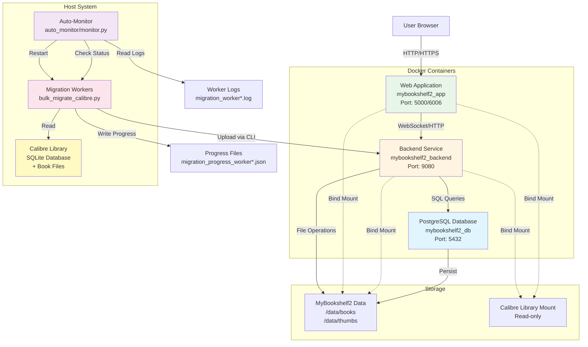
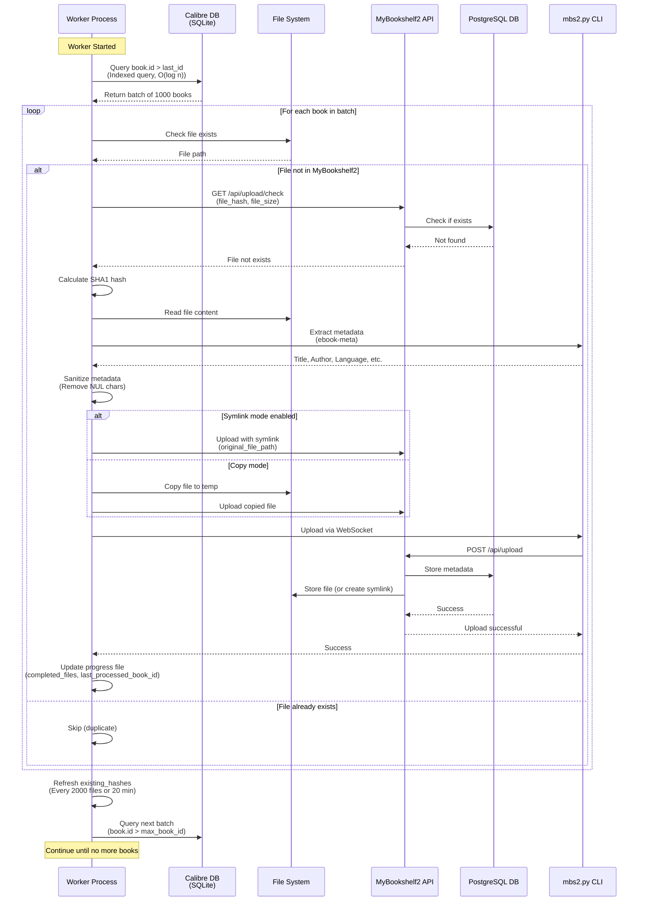
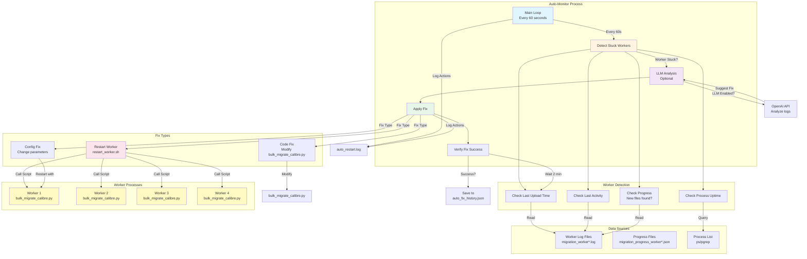
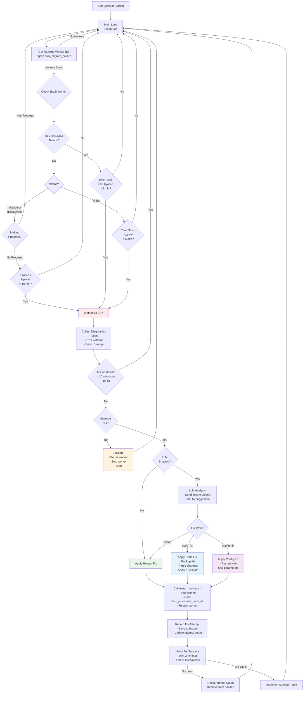

# MyBookshelf2 Architecture Diagrams

## 1. MyBookshelf2 Application Design

```mermaid
graph TB
    subgraph "Docker Containers"
        DB[PostgreSQL Database<br/>mybookshelf2_db<br/>Port: 5432]
        BACKEND[Backend Service<br/>mybookshelf2_backend<br/>Port: 9080]
        APP[Web Application<br/>mybookshelf2_app<br/>Port: 5000/6006]
    end
    
    subgraph "Host System"
        CALIBRE[Calibre Library<br/>SQLite Database<br/>+ Book Files]
        WORKERS[Migration Workers<br/>bulk_migrate_calibre.py]
        MONITOR[Auto-Monitor<br/>auto_monitor/monitor.py]
    end
    
    subgraph "Storage"
        DATA_DIR[MyBookshelf2 Data<br/>/data/books<br/>/data/thumbs]
        CALIBRE_MOUNT[Calibre Library Mount<br/>Read-only]
    end
    
    USER[User Browser] -->|HTTP/HTTPS| APP
    APP -->|WebSocket/HTTP| BACKEND
    BACKEND -->|SQL Queries| DB
    BACKEND -->|File Operations| DATA_DIR
    
    WORKERS -->|Read| CALIBRE
    WORKERS -->|Upload via CLI| BACKEND
    WORKERS -->|Write Progress| PROGRESS[Progress Files<br/>migration_progress_worker*.json]
    
    MONITOR -->|Read Logs| WORKER_LOGS[Worker Logs<br/>migration_worker*.log]
    MONITOR -->|Restart| WORKERS
    MONITOR -->|Check Status| WORKERS
    
    APP -.->|Bind Mount| DATA_DIR
    BACKEND -.->|Bind Mount| DATA_DIR
    BACKEND -.->|Bind Mount| CALIBRE_MOUNT
    APP -.->|Bind Mount| CALIBRE_MOUNT
    
    DB -->|Persist| DATA_DIR
    
    style DB fill:#e1f5ff
    style BACKEND fill:#fff4e1
    style APP fill:#e8f5e9
    style WORKERS fill:#fce4ec
    style MONITOR fill:#f3e5f5
    style CALIBRE fill:#fff9c4
```

## 2. Migration Process: Calibre to MyBookshelf2

```mermaid
sequenceDiagram
    participant W as Worker Process
    participant C as Calibre DB<br/>(SQLite)
    participant F as File System
    participant API as MyBookshelf2 API
    participant DB as PostgreSQL DB
    participant CLI as mbs2.py CLI
    
    Note over W: Worker Started
    W->>C: Query book.id > last_id<br/>(Indexed query, O(log n))
    C-->>W: Return batch of 1000 books
    
    loop For each book in batch
        W->>F: Check file exists
        F-->>W: File path
        
        alt File not in MyBookshelf2
            W->>API: GET /api/upload/check<br/>(file_hash, file_size)
            API->>DB: Check if exists
            DB-->>API: Not found
            API-->>W: File not exists
            
            W->>W: Calculate SHA1 hash
            W->>F: Read file content
            
            W->>CLI: Extract metadata<br/>(ebook-meta)
            CLI-->>W: Title, Author, Language, etc.
            
            W->>W: Sanitize metadata<br/>(Remove NUL chars)
            
            alt Symlink mode enabled
                W->>API: Upload with symlink<br/>(original_file_path)
            else Copy mode
                W->>F: Copy file to temp
                W->>API: Upload copied file
            end
            
            W->>CLI: Upload via WebSocket
            CLI->>API: POST /api/upload
            API->>DB: Store metadata
            API->>F: Store file (or create symlink)
            DB-->>API: Success
            API-->>CLI: Upload successful
            CLI-->>W: Success
            
            W->>W: Update progress file<br/>(completed_files, last_processed_book_id)
        else File already exists
            W->>W: Skip (duplicate)
        end
    end
    
    W->>W: Refresh existing_hashes<br/>(Every 2000 files or 20 min)
    W->>C: Query next batch<br/>(book.id > max_book_id)
    
    Note over W: Continue until no more books
```

## 3. Monitor Mechanism

```mermaid
graph TB
    subgraph "Auto-Monitor Process"
        MAIN[Main Loop<br/>Every 60 seconds]
        DETECT[Detect Stuck Workers]
        ANALYZE[LLM Analysis<br/>Optional]
        FIX[Apply Fix]
        VERIFY[Verify Fix Success]
    end
    
    subgraph "Worker Detection"
        CHECK_UPLOAD[Check Last Upload Time]
        CHECK_ACTIVITY[Check Last Activity]
        CHECK_PROGRESS[Check Progress<br/>New files found?]
        CHECK_UPTIME[Check Process Uptime]
    end
    
    subgraph "Fix Types"
        RESTART[Restart Worker<br/>restart_worker.sh]
        CODE_FIX[Code Fix<br/>Modify bulk_migrate_calibre.py]
        CONFIG_FIX[Config Fix<br/>Change parameters]
    end
    
    subgraph "Worker Processes"
        W1[Worker 1<br/>bulk_migrate_calibre.py]
        W2[Worker 2<br/>bulk_migrate_calibre.py]
        W3[Worker 3<br/>bulk_migrate_calibre.py]
        W4[Worker 4<br/>bulk_migrate_calibre.py]
    end
    
    subgraph "Data Sources"
        LOGS[Worker Log Files<br/>migration_worker*.log]
        PROGRESS[Progress Files<br/>migration_progress_worker*.json]
        PROCESSES[Process List<br/>ps/pgrep]
    end
    
    MAIN -->|Every 60s| DETECT
    DETECT --> CHECK_UPLOAD
    DETECT --> CHECK_ACTIVITY
    DETECT --> CHECK_PROGRESS
    DETECT --> CHECK_UPTIME
    
    CHECK_UPLOAD -->|Read| LOGS
    CHECK_ACTIVITY -->|Read| LOGS
    CHECK_PROGRESS -->|Read| LOGS
    CHECK_UPTIME -->|Query| PROCESSES
    
    DETECT -->|Worker Stuck?| ANALYZE
    ANALYZE -->|LLM Enabled?| LLM_API[OpenAI API<br/>Analyze logs]
    LLM_API -->|Suggest Fix| ANALYZE
    
    ANALYZE --> FIX
    FIX -->|Fix Type| RESTART
    FIX -->|Fix Type| CODE_FIX
    FIX -->|Fix Type| CONFIG_FIX
    
    RESTART -->|Call Script| W1
    RESTART -->|Call Script| W2
    RESTART -->|Call Script| W3
    RESTART -->|Call Script| W4
    
    CODE_FIX -->|Modify| SOURCE[bulk_migrate_calibre.py]
    CONFIG_FIX -->|Restart with| W1
    
    FIX --> VERIFY
    VERIFY -->|Wait 2 min| CHECK_UPLOAD
    VERIFY -->|Success?| HISTORY[Save to<br/>auto_fix_history.json]
    
    MAIN -->|Log Actions| LOG_FILE[auto_restart.log]
    FIX -->|Log Actions| LOG_FILE
    
    style MAIN fill:#e1f5ff
    style DETECT fill:#fff4e1
    style ANALYZE fill:#f3e5f5
    style FIX fill:#e8f5e9
    style RESTART fill:#fce4ec
    style W1 fill:#fff9c4
    style W2 fill:#fff9c4
    style W3 fill:#fff9c4
    style W4 fill:#fff9c4
```

## Detailed Monitor Flow

```mermaid
flowchart TD
    START[Auto-Monitor Started] --> LOOP[Main Loop<br/>Sleep 60s]
    
    LOOP --> GET_WORKERS[Get Running Worker IDs<br/>pgrep bulk_migrate_calibre]
    
    GET_WORKERS -->|No workers| LOOP
    GET_WORKERS -->|Workers found| CHECK_WORKER{Check Each Worker}
    
    CHECK_WORKER --> HAS_UPLOAD{Has Uploaded<br/>Before?}
    
    HAS_UPLOAD -->|Yes| CHECK_UPLOAD_TIME{Time Since<br/>Last Upload<br/>> 5 min?}
    HAS_UPLOAD -->|No| CHECK_STATUS{Status?}
    
    CHECK_STATUS -->|initializing/<br/>discovering| CHECK_PROGRESS{Making<br/>Progress?}
    CHECK_STATUS -->|Other| CHECK_ACTIVITY{Time Since<br/>Activity<br/>> 5 min?}
    
    CHECK_PROGRESS -->|No Progress| CHECK_UPTIME{Process<br/>Uptime<br/>> 10 min?}
    CHECK_PROGRESS -->|Has Progress| LOOP
    
    CHECK_UPTIME -->|Yes| STUCK[Worker STUCK]
    CHECK_UPTIME -->|No| LOOP
    
    CHECK_UPLOAD_TIME -->|Yes| STUCK
    CHECK_UPLOAD_TIME -->|No| LOOP
    
    CHECK_ACTIVITY -->|Yes| STUCK
    CHECK_ACTIVITY -->|No| LOOP
    
    STUCK --> COLLECT_DIAG[Collect Diagnostics<br/>- Logs<br/>- Error patterns<br/>- Book ID range]
    
    COLLECT_DIAG --> CHECK_COOLDOWN{In Cooldown?<br/>< 10 min since<br/>last fix}
    CHECK_COOLDOWN -->|Yes| LOOP
    CHECK_COOLDOWN -->|No| CHECK_ATTEMPTS{Attempts<br/>< 3?}
    
    CHECK_ATTEMPTS -->|No| ESCALATE[Escalate<br/>- Pause worker<br/>- Stop worker<br/>- Alert]
    CHECK_ATTEMPTS -->|Yes| LLM_ENABLED{LLM<br/>Enabled?}
    
    LLM_ENABLED -->|Yes| LLM_ANALYZE[LLM Analysis<br/>- Send logs to OpenAI<br/>- Get fix suggestion]
    LLM_ENABLED -->|No| RESTART_FIX[Apply Restart Fix]
    
    LLM_ANALYZE --> FIX_TYPE{Fix Type?}
    FIX_TYPE -->|restart| RESTART_FIX
    FIX_TYPE -->|code_fix| CODE_FIX[Apply Code Fix<br/>- Backup file<br/>- Parse changes<br/>- Apply & validate]
    FIX_TYPE -->|config_fix| CONFIG_FIX[Apply Config Fix<br/>- Restart with<br/>new parameters]
    
    RESTART_FIX --> CALL_SCRIPT[Call restart_worker.sh<br/>- Stop worker<br/>- Read last_processed_book_id<br/>- Restart worker]
    CODE_FIX --> CALL_SCRIPT
    CONFIG_FIX --> CALL_SCRIPT
    
    CALL_SCRIPT --> RECORD[Record Fix Attempt<br/>- Save to history<br/>- Update attempt count]
    
    RECORD --> VERIFY_FIX[Verify Fix Success<br/>- Wait 2 minutes<br/>- Check if recovered]
    
    VERIFY_FIX -->|Success| RESET[Reset Attempt Count<br/>Remove from paused]
    VERIFY_FIX -->|Still Stuck| INCREMENT[Increment Attempt Count]
    
    RESET --> LOOP
    INCREMENT --> LOOP
    ESCALATE --> LOOP
    
    style STUCK fill:#ffebee
    style ESCALATE fill:#fff3e0
    style RESTART_FIX fill:#e8f5e9
    style CODE_FIX fill:#e3f2fd
    style CONFIG_FIX fill:#f3e5f5
```

